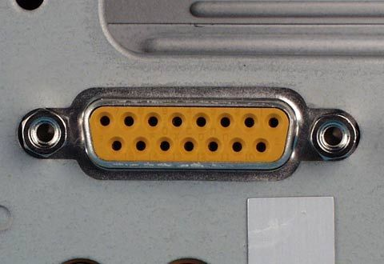
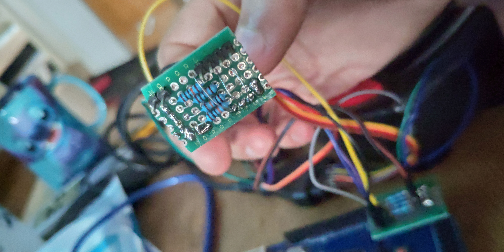
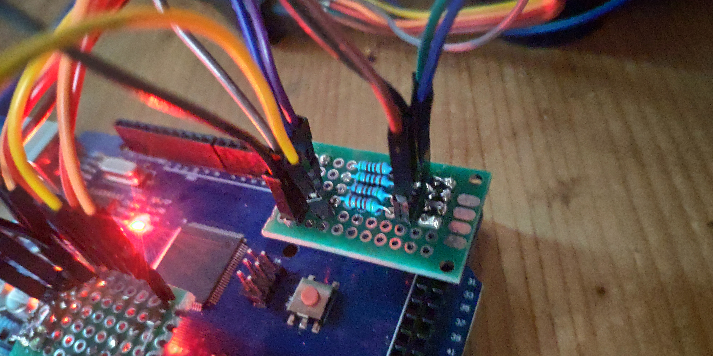
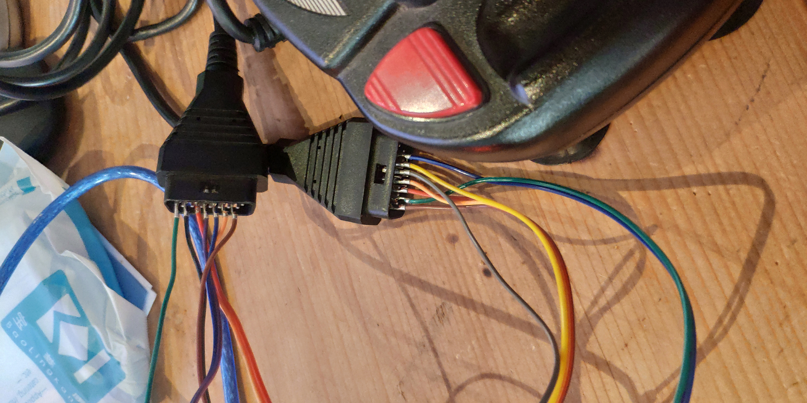
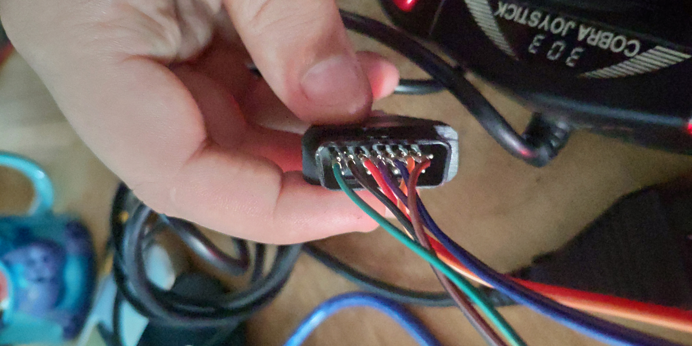
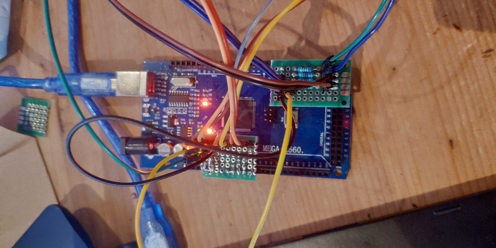

# Game port to Xbox 360 controller

This Project is a quick adaptation of old joysticks with Game connectors to an in-game usable Xbox 360 controller.  

  

I made this project from scratch in approximately 7 hours, including the controller retro engineering (understanding which button is connected to what pin), the tests on breadboard, the soldering of small PCBs and the signal processing on the Arduino and the computer.  

# Why does this project exist ?

I found these 2 old joystick in my old computer devices, I found it will be fun to play recent games with totally inappropriate device, I made it.  
That it !  

# What is the Game port ?

The Game port is an old PC port that was used for game controllers or also midi controller in the 90's.  
This port is no more present on recent computers and was replaced by the well known USB, which have more generic usage.  

  

It is also a rare PC port that have analogic pins, what often cause it to be palced next to or on the sound card.  

  

# Arduino side

I choose here to use my Arduino Mega, hoping that it will natively suport HID, but it was not.  
After some reasearsh and test on a breadboard and some dumb mistakes that cost me time (like setting the analogic port mode on OUTPUT instead of INPUT), I decided to make 2 small PCB "shields".  

  

  

To connect it all, I use standand jumper cable which I remove the plastic part and enlarged for the Game connector side.  

  

  

There is 2 joystick axis on each joystick, X and Y, and 4 buttons, which are in fact 2 as 3 of them are connected together in the joystick (these are cheap joystick buyed more than 20 years ago !).  
With the 2 joystick, it means 4 Analogic pin and 4 Digital pin.  

  

Finaly, data are sended over the serial connection of the Arduino connected on USB.  

# Computer side

I choose to use python as i am used to it.  
I found the [PYXinput](https://github.com/bayangan1991/PYXInput/tree/master/pyxinput) library that made exactly what I want. It just required to instal a driver but it works perfectly.  
The Python code basicaly connect the serial communication port to the Arduino, create a virtual Xbox 360 controller and loop on reading serial data, converting it from a 0 => 1024 range to a -1 => 1 value for each axis and set the virtual controller states.  